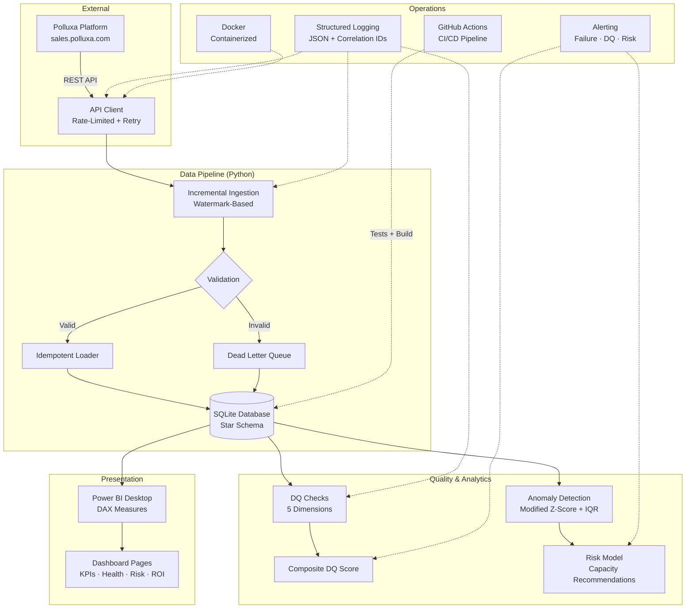

# Architecture — LinkedIn Agent Analytics Platform

## System Architecture

## Component Overview

| Component | Purpose | Technology |
|-----------|---------|------------|
| **API Client** | Secure, rate-limited API communication | Python `requests` + `tenacity` |
| **Ingestion Engine** | Incremental data loading with watermarks | Custom Python, SQLite |
| **Star Schema** | Dimensional data model | SQLite DDL |
| **DQ Framework** | Automated quality validation | Custom Python (5 dimensions) |
| **Anomaly Detection** | Statistical outlier identification | `scipy`, `numpy`, Modified Z-Score |
| **Risk Model** | Account classification + capacity limits | Custom Python, `pandas` |
| **Power BI** | Dashboard visualization | Power BI Desktop + DAX |
| **CI/CD** | Automated testing and deployment | GitHub Actions |
| **Container** | Reproducible deployment | Docker |
| **Observability** | Logging and alerting | `structlog` (JSON) |

## Security Architecture

- **Secrets**: All credentials stored in `.env`, never in source control
- **`.env.example`**: Template with placeholder values committed to repo
- **API Auth**: Bearer token + API secret in request headers
- **Database**: Local SQLite file with WAL mode for safe concurrent access
- **Container**: Runs as non-root user with minimal attack surface
