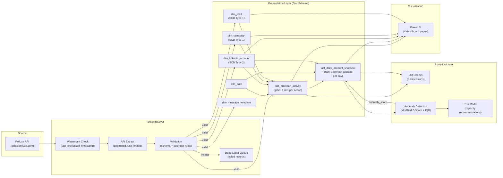
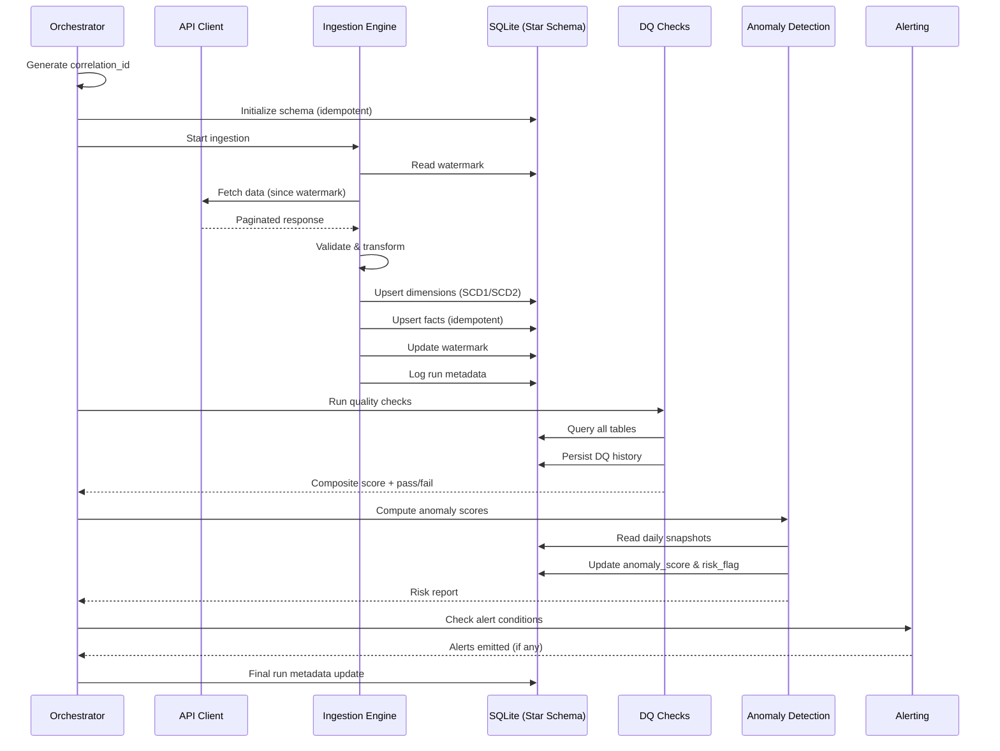

# Data Flow Diagram — LinkedIn Agent Analytics Platform

## End-to-End Data Flow

## Pipeline Execution Flow

## Data Refresh Schedule

| Entity | Refresh Type | Trigger | Watermark Column |
|--------|-------------|---------|-----------------|
| Campaigns | Full | Every run | N/A |
| Leads | Incremental | Every run | `updated_at` |
| Activities | Incremental | Every run | `activity_timestamp` |
| Daily Snapshots | Computed | After activity load | N/A (aggregated) |
| DQ Checks | Full | After every load | N/A |
| Anomaly Scores | Full | After DQ checks | N/A |
